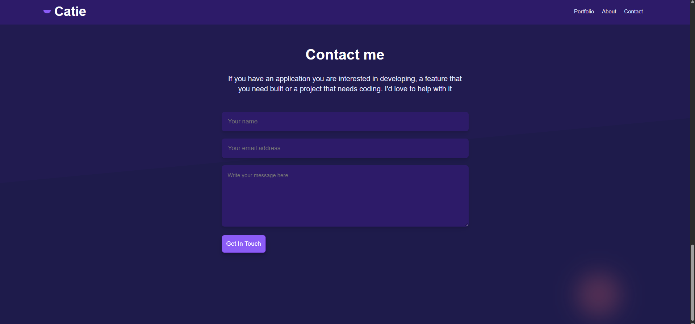

# Personal Portfolio – HTML, CSS and JS Assignment

**Author:** Catherine Matu  
**Course:** CodeKenya Software Engineering Program  
**Assignment Objective:** Build a complete personal portfolio using semantic HTML, modern CSS techniques, and JavaScript.

---

  
  


---

## Project Overview

This project is a frontend development assignment for the **CodeKenya Software Engineering Curriculum**.  
The objective is to showcase **HTML5, CSS3, and responsive design skills** by building a developer portfolio that includes:  

- Navigation menu  
- Project showcase section  
- Contact form integration  
- Visually accessible styling with CSS variables  

The portfolio was **built from scratch** using **pure HTML, CSS, and minimal JavaScript**—highlighting **fundamental frontend development skills**.

---

## Project Structure
## MY-PORTFOLIO Project Structure

```
MY-PORTFOLIO
│
├── .vscode/                     # ⚙VS Code workspace settings
│
├── assets/                      # Project assets (images, icons, fonts)
│   └── img/
│       ├── lang/                # Language logos
│       │   ├── css3.png
│       │   ├── html.png
│       │   └── js.png
│       │
│       └── projects/            # Project screenshots
│           ├── codekenya.png
│           ├── usapp.png
│           ├── portfolio.png    #Portfolio page
│           ├── contact.png      # Contact page
│           └── aboutme.png      # About Me page
│
├── index.html                   # Main portfolio homepage
├── index-nojs.html              #  Version without JavaScript
├── index-nostyle-nojs.html      #  Pure semantic HTML version
│
├── menu.js                      # Navigation menu logic
├── projects.js                  # 🖥 Script for projects section
│
└── styles.css                   # 🎨 Main stylesheet 
```


## Key Features

- **Semantic HTML5** layout  
- **Sticky navigation bar** with smooth scrolling  
- **SVG hamburger menu icon** for mobile navigation  
- **Responsive design** for all screen sizes  
- **Custom CSS variables** for theming and easy updates  
- **Contact form integration** via  [Formspree](https://formspree.io/)  
- **Accessible and clean visual hierarchy**  

---

## How to Run Locally

1. Clone the repository:
   ```bash
   git clone https://github.com/Cathy-matu/curriculum-assignment-submission.git
   cd my-portfolio
2. Open in your browser:

   -Double-click index.html or index-nojs.html

   -OR open in VS Code and use the Live Server extension

## Contact Form

The contact section uses [Formspree](https://formspree.io/) for backend-less form submissions:

```html
<form action="https://formspree.io/f/[your_form_id]" method="POST">
  <input type="text" name="name" placeholder="Your Name" required>
  <input type="email" name="email" placeholder="Your Email" required>
  <textarea name="message" placeholder="Your Message"></textarea>
  <button type="submit">Send</button>
</form>
```

> Replace `[your_form_id]` with your actual Formspree form endpoint.

---

## Author

**Catherine Matu**  
- Frontend Developer | Software Developer Trainee 
- Nairobi, Kenya

---

## License

- This project is licensed under the **MIT License**  
- Feel free to reuse and adapt for personal or educational purposes

---

## Acknowledgements

- Special thanks to **CodeKenya** and the curriculum team for this hands-on assignment


